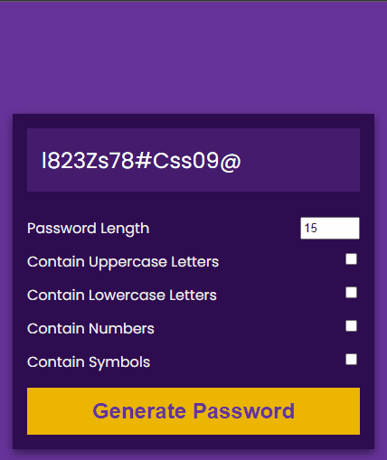
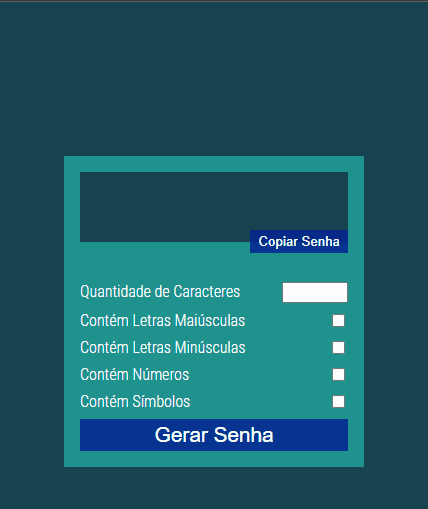

# Password Generator 🔐

Tired of generating passwords? This application will give you a new one! ✌

## 🚀 Technologies
- HTML
- CSS
- JavaScript

## ℹ Description/Important notes

It was inspired by a project made by Florin Pop. Below there is his original project:
- https://github.com/florinpop17/10-projects-10-hours/tree/master/password-generator

My intention in this project was to learn how a password can be generated automatically and practice it using Class on JavaScript, because Florin made using functions on his project.

I did some modifications on HTML and CSS as you can compare below:

### Original by Florin Pop:

<h1>
  
</h1>

### Now, it's mine project working:

<h1>
  
</h1>

The changes which I made on JS were to transform everything in a Class, just to practice a little more what I have been studying about it.

Well, it's not everything about the project, but I just want to bring here what I did differently to practice what I have been learning!

## 📝License
This project is under the MIT license. See the [LICENSE](https://choosealicense.com/licenses/mit/) for more information.

##

If you want to collaborate, to give some opinion, if you know a different way to do, or just want to make a new friend, than send me a e-mail or message on my LinkedIn:
 
  

##

Made with much 💜 by Lucas Virolli 🙋‍♂️
